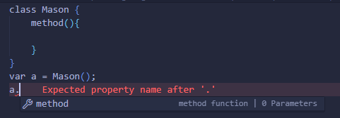
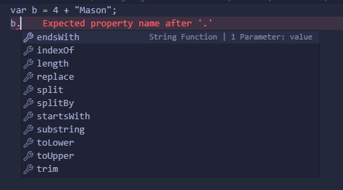
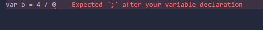
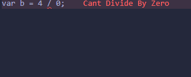

# ScarbroScript

A Comprehensive Overview of My Programming Language
My programming language is an evolution of Jlox, with numerous enhancements and additional features. While it maintains the core principles of Jlox, it introduces several new concepts and functionalities, making it a versatile and powerful language.

Core Features
1. Syntax Enhancements
Break Statements: Support for break statements enables easier control flow within loops and switch statements.
Multiline Comments: Added support for multiline comments using /* */, enhancing code readability.
2. Advanced Data Structures
Arrays: Arrays are introduced as a versatile data structure, akin to lists, supporting dynamic sizing and mixed element types.
List Operations: Added array manipulation functions like set, get, and add for efficient data handling.
3. Built-in Modules
Math Module: In-house modules like Math provide access to mathematical functions for complex computations.
IO Module: Provides IO functionalities for input/output operations, enhancing interaction with the environment.
4. Object Instance Functions
String Methods: String instances support various methods like substring(), enhancing string manipulation capabilities.
Array Methods: Array instances support methods like append() for efficient array manipulation.
5. Modern Language Features
Classes and Functions: Support for defining classes and functions facilitates structured programming.
Prefix Increment/Decrement Operators: Modern operators like ++ and -- are supported for convenience and readability.
Is Keyword: Borrowed from C#, the is keyword enhances type-checking capabilities.
6. Context-Based Features
Exists Keyword: Introduced the exists keyword to check the existence of previous items within context, aiding in data structure manipulation and error handling.

# ScarbroScriptLSP
Error Handling

Parser Errors: The LSP handles basic parser errors, providing real-time feedback to developers for syntax issues during code writing.
Runtime Errors: Some Basic runtime error detection is supported, allowing users to catch and address issues as they arise during execution.
Autocompletion

Auto-Generation: The LSP supports basic autocompletion, automatically generating suggestions for methods, variables, and functions based on the current context.
Contextual Suggestions: Autocompletion adapts based on the surrounding code, enhancing development speed and accuracy.
Hover Requests

Information on Demand: Hover requests are supported, allowing users to hover over elements in the code to receive detailed information such as type definitions, documentation, and more. This feature aids in quick reference and learning without disrupting the coding flow.

https://github.com/MasonScarbro/ScarbroScript/assets/120221711/868d6e4a-8bda-40bc-a4bd-f860a866b5b7

